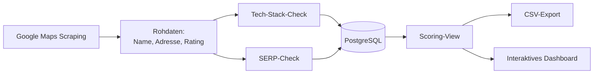

#Lead-Scoring-Pipeline für lokale Unternehmen


> Automatisierte Pipeline, die lokale Unternehmen anhand ihrer Google-Sichtbarkeit und ihres Marketing-Tracking-Setups bewertet und priorisierte Lead-Listen für die Neukundenansprache erstellt. Proof Of Concept Tool von Dominik-Kay Hantusch zum Lösen eines Realworldproblems übers Data Engineering und automatisierter Data Analytic.

Das Problem
Viele lokale Unternehmen (Handwerker, Ärzte, Dienstleister) schalten Google Ads, ohne Conversion-Tracking eingerichtet zu haben – sie verbrennen Werbebudget, ohne es zu merken. Andere haben starken SEO-Beratungsbedarf, sind aber online kaum sichtbar. Diese Kandidaten manuell zu finden ist mühsam.
Diese Pipeline automatisiert genau das: Sie durchsucht Google Maps nach Unternehmen in einer Nische/Region, prüft organische Sichtbarkeit und technisches Tracking-Setup und berechnet daraus einen priorisierten Score, der zeigt, wer am dringendsten – und lohnendsten – für eine Ansprache ist.

Funktionsweise

Scraping (`google_places.py`) – findet Unternehmen einer Nische/Standort-Kombination über Google Maps.
Anreicherung (`tech_scraper.py`, `serp_checker.py`) – prüft nebenherlaufend das aktuelle Tracking-Setup und organische Google-Position.
Persistierung (`db.py`) – schreibt alles per Upsert in PostgreSQL für die Verwertung der Datensätze.
Scoring (`sql/schema.sql`, View `vw_lead_scoring`) – berechnet einen gewichteten Score aus drei Faktoren.
Output – priorisierte Liste als CSV (`export_csv.py`) oder interaktives HTML-Dashboard (`visualize.py`).
Das Scoring-Modell
Der `final_score` ist eine gewichtete Kombination aus drei Indizes, die so ebenfalls laut dem Springer BWL Guide in der Evaluation verwendet werden. Die Potenzen müssten über die Monate hindurch anhand der Praxiserfahrung umgewichtet werden. Zunächst wurden naheliegende Ausgangswerte aus dem Buch genutzt (Gewichte konfigurierbar über die Tabelle `scoring_weights`):
Index	Bedeutung	Basiert auf
b_index	Business-Größe/Aktivität	Anzahl Google-Bewertungen (log-skaliert)
n_index	SEO-Bedarf	Abstand des organischen Google-Rankings von den Top 10
p_index	Pitch-Potenzial	Ads-Schaltung × fehlendes Tracking – der eigentliche "verbrennt Budget"-Indikator
```
final_score = (b_index^α · n_index^β · p_index^γ) × 100
```
Tech Stack
Python 3.11+ – Scraping, Enrichment, Orchestrierung
Playwright – headless Browser-Automatisierung (Maps, Google-Suche, Zielseiten)
PostgreSQL (Neon) – Persistenz & Scoring-Logik (SQL-View)
psycopg2 – DB-Layer
Pandas / Plotly – Auswertung & interaktives Dashboard
ThreadPoolExecutor – parallelisiertes Enrichment
Setup
```bash
git clone https://github.com/<dein-username>/<repo-name>.git
cd <repo-name>

python -m venv venv
source venv/bin/activate        # Windows: venv\Scripts\activate

pip install -r requirements.txt
playwright install chromium

cp .env.example .env            # DATABASE_URL eintragen
psql "$DATABASE_URL" -f sql/schema.sql
```
Usage
```bash
# Suchmatrix in leadgen/config.py anpassen, dann:
python -m leadgen.pipeline

# Priorisierte Leads als CSV exportieren
python -m leadgen.export_csv --limit 200

# Interaktives Dashboard erzeugen
python -m leadgen.visualize
```
Projektstruktur
```
.
├── leadgen/
│   ├── config.py
│   ├── google_places.py   # Playwright-Scraper – nutzt NICHT die offizielle Places API
│   ├── serp_checker.py
│   ├── tech_scraper.py
│   ├── pipeline.py         # Orchestrierung
│   ├── db.py
│   ├── export_csv.py
│   └── visualize.py
├── sql/schema.sql          # Tabellen + Scoring-View
├── tests/
└── requirements.txt
```

Bekannte Einschränkungen

[ ] Scraping-Selektoren sind an Googles aktuelles DOM gebunden und können jederzeit brechen

[ ] Aktuell wird pro Lead ein neuer Browser-Prozess gestartet (Performance-Optimierung geplant)

[ ] Company-Name-Matching im SERP-Check ist ein einfacher Token-Heuristik-Ansatz, kein exaktes Matching

Rechtliche Hinweise
Dieses Projekt scrapt öffentlich sichtbare Google-Suchergebnisse ohne offizielle API – das steht im Widerspruch zu Googles Nutzungsbedingungen. Es dient hier als Demo-/Lernprojekt. Für einen produktiven Einsatz würde ich auf offizielle, kostenpflichtige APIs (Google Places API, ein SERP-API-Anbieter) umsteigen, was im Übrigen auch die
verwertbare Menge an Rohdaten positiv beeinflussen kann.

Roadmap

[ ] Unit-Tests für reine Funktionen (`_normalize`, `_match_company`, `_clean_url`)
[ ] Browser-Wiederverwendung statt Neustart pro Lead
[ ] GitHub Actions: Linting (ruff) + Tests bei jedem Push
[ ] Dockerfile für reproduzierbares Setup
[ ] Offizielle APIs als Alternative zum Scraping


Was ich dabei gelernt habe

Die größte Herausforderung war definitiv das Webscraping.
Obwohl das ganze Projekt unfassbar viel Spaß in der Planung und Nutzung machte, war es erstaunlich ungewohnt den Logikwechsel in den Datenbezug aus TS, JS, CSS, HTML usw
vollständig zu greifen um die entsprechenden Daten auch wiederverwertbar und zuverlässig zu beziehen.
Da es sich um einen ProofOfConcept und ein reines Lernprojekt handelt, mit dem ich ein Real-World-Problem angehen wollte, welches viele Ads-Professionals tatsächlich tagtäglich haben, entschied ich mich dazu meine eigenen Ressourcen zu schonen und umzudenken. Letztlich ist es sogar gelungen, das Modell kostenlos laufen zu lassen!
Beim nächsten Mal, würde ich die Daten zusätzlich in Excel Tabellen speichern und automatisiertes Data Warehousing zu betreiben, welches über einen Index und in den Grundfunktionen über eine Hashmap in der Anwendung beschleunigt werden könnte. So ließe sich ein Fundament bauen um Trends und Marktentwicklungen zu bemessen.

